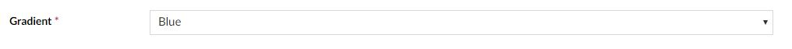
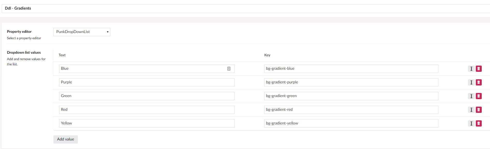

# punkDropDownList

An app_plugin for Umbraco that provides an Umbraco Drop Down List with Text and Key.

There is an included PropertyValueConverter to provide you with the value of the selected item in the CMS. 

### Credits

I used uDynamic's dropdownlist property editor to form the basis of this propertyeditor.

https://github.com/Alain-es/uDynamic/tree/master/uDynamic/App_Plugins/PropertyEditors/DropdownList

### Compatibility

- Umbraco 8+

### Screenshot

### DataType

